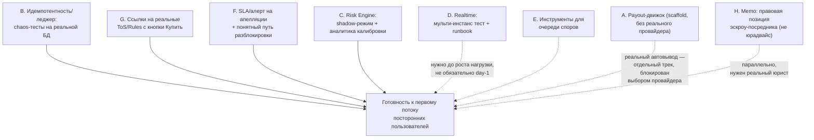

# План закрытия критичных блокеров перед запуском

## Контекст из кода (важные находки)

- **Выводы сейчас** — это ledger-дебет `WITHDRAWAL` в [operations.module.ts](safe-deal-platform/src/operations.module.ts) (строки 384-494), без вызова какого-либо платёжного провайдера. Админка ([WithdrawalsScreen.tsx](onix-admin/src/screens/WithdrawalsScreen.tsx)) прямо пишет: «Автоплатежи не подключены — статус REVIEW требует ручной выплаты». Провайдер `TinkoffAcquiringProvider` ([tinkoff.provider.ts](safe-deal-platform/src/economy/payments/tinkoff.provider.ts)) реализует только приём денег (Init/GetQr/webhook), метода выплат там нет.
- **Идемпотентность уже сильная**: `IdempotencyService.runTransactional` (advisory lock + Serializable TX), уникальные `idempotencyKey` на `LedgerEntry`, `DepositLedgerEntry`, `PaymentIntent`, `Order`. Тесты есть ([idempotency-money.test.ts](safe-deal-platform/test/idempotency-money.test.ts), [ledger-property.test.ts](safe-deal-platform/test/ledger-property.test.ts), [monetary-invariants.e2e.test.ts](safe-deal-platform/test/monetary-invariants.e2e.test.ts)), но большинство гоняют модель в памяти (`LedgerModel`) или последовательные повторы — не настоящую параллельную нагрузку на реальный Postgres.
- **Risk Engine**: пороги уже вынесены в env (`RISK_MONITOR_SCORE`, `RISK_STEP_UP_SCORE`, `RISK_LOCK_SCORE`=70, `RISK_CRITICAL_SCORE`=85) в [risk-engine.scoring.ts](safe-deal-platform/src/risk/risk-engine.scoring.ts). Score=100 — это просто потолок, не спец-триггер бана. Авто-действие — `SecurityLockService.applyLock` (HIGH/CRITICAL), не хардбан. Апелляция уже есть: [support-center.service.ts](safe-deal-platform/src/support-center.service.ts) (`createAppeal`), решения админа — [security-lock.service.ts](safe-deal-platform/src/risk/security-lock.service.ts) (`KEEP_LOCK/UNLOCK/REDUCE_RESTRICTIONS/PERMANENT_BAN`). Нет режима «shadow» (считать, но не применять) для калибровки на живом трафике.
- **Realtime**: код УЖЕ поддерживает мульти-инстанс через Redis pub/sub — [realtime-bus.service.ts](safe-deal-platform/src/realtime/realtime-bus.service.ts) публикует/подписывается через `SharedCoordinationService`, [ops-gates.ts](safe-deal-platform/src/ops-gates.ts) требует Redis при `WEB_CONCURRENCY > 1`. Но в проде осознанно держат 1 реплику Amvera: `ONIX-AMVERA-PRODUCTION.md` — «Replicas: Keep 1 while www points at this project». Т.е. блокер — не отсутствие кода, а неподтверждённость (нет теста на 2+ инстанса) и вендорское ограничение (масштабирование реплик у Amvera — через тикет поддержки).
- **Споры**: очередь общая, нет поля `assignee`; SLA-джоб [dispute-sla.job.ts](safe-deal-platform/src/workers/jobs/dispute-sla.job.ts) шлёт алерт через 7 дней и НЕ делает авто-рефанд (осознанно). Апелляции на блокировку не имеют отдельного SLA/алерта.
- **Юр. документы**: `/terms.html` и `/rules.html` — это реальные, содержательные документы (не заглушки!), но кнопка «Купить» в [LotSheet.tsx](onix-frontend/src/screens/LotSheet.tsx) ссылается на них только текстом, без ссылок. `/privacy.html` честно пишет: «Полные реквизиты оператора... будут дополнены по мере оформления» — юрлица пока нет (вы подтвердили).
- **Ваши ответы на уточнения**: (1) payout-провайдера пока нет — строим инфраструктуру со слотом под провайдера, включаем позже; (2) юрлица/ИП пока нет.

## Диаграмма: приоритет и зависимость направлений

Сплошные стрелки — блокеры для открытия даже небольшому новому потоку. Пунктирные — важно, но не обязаны блокировать самый первый впуск посторонних, если нагрузка стартует мало.

## Workstream A — Автоматический вывод средств (инфраструктура, без реального провайдера)

Реального payout-провайдера нет — строю **готовую к подключению инфраструктуру**, работающую сегодня как ускоренный полу-авто процесс, и одной интеграцией включаемую в полный автомат, когда появится провайдер.

- Новые модели в `prisma/schema.prisma`: `PayoutRequest` (состояния `REQUESTED → RISK_REVIEW → APPROVED → PROCESSING → PAID / FAILED / REJECTED / MANUAL_REVIEW`) и `PayoutAttempt` (лог вызовов провайдера, для ретраев/сверки). Существующий `LedgerEntry(type='WITHDRAWAL')` остаётся источником истины по деньгам — `PayoutRequest` привязывается к нему через `correlationId`/`idempotencyKey`, не дублирует дебет.
- Интерфейс `PayoutProvider` по образцу [payment-provider.ts](safe-deal-platform/src/economy/payments/payment-provider.ts): `MANUAL` реализация = сегодняшний ручной процесс (без изменений для админа), плюс место для реальной интеграции (Tinkoff B2B/СБП-выплаты и т.п.) одним классом.
- Правила авто-одобрения (переиспользуем уже посчитанные риск-факторы, включая существующий `NEW_PAYOUT_DEST`): лимиты на сумму/день/месяц, возраст аккаунта, отсутствие открытого clawback-долга (уже проверяется), риск-скор ниже порога. Не проходит — падает в существующую очередь `WithdrawalsScreen` с явным основанием, админ одобряет/отклоняет одной кнопкой (это уже большое ускорение по сравнению с «ручным пайплайном» — админ жмёт кнопку вместо ручного перевода).
- Идемпотентные вызовы провайдера, повторная сверка статуса (poll/webhook), алерты на «зависшие» `PROCESSING`.
- Флаг `PAYOUTS_AUTO_ENABLED` (по умолчанию `false`) — включение реального автовывода одним конфигом, когда появится контракт с провайдером.

## Workstream B — Идемпотентность и целостность леджера: реальная проверка (не только тесты)

- Новый набор `test/ledger-chaos.e2e.test.ts`, работающий на настоящей тестовой Postgres (не in-memory `LedgerModel`):
  - двойной клик по покупке — 20 параллельных `Promise.all` запросов с одним `idempotencyKey` → ровно один дебет;
  - двойной клик по выводу — аналогично на `wallet.withdraw`;
  - повторная доставка вебхука Tinkoff (та же полезная нагрузка N раз параллельно) → одно зачисление;
  - «обрыв на середине» — принудительный abort транзакции после части записей → проверка инвариантов (`balanceAfterCents` = сумма записей) через существующий чекер из [monetary-invariants.e2e.test.ts](safe-deal-platform/test/monetary-invariants.e2e.test.ts);
  - конкурентные `complete`/`refund`/`admin-refund` гонки на одном заказе.
- Добавить npm-скрипт (`test:ledger-chaos`) и прогнать перед первым потоком новых пользователей. Любой найденный баг фиксится сразу, с новым regression-тестом.
- Итог — короткий отчёт: что прогнано, что нашли, что исправили.

## Workstream C — Калибровка Risk Engine на реальном трафике

- Добавить режим **shadow/soft-launch**: новый флаг (например `RISK_ENFORCEMENT_MODE=shadow`), при котором `enforceBlockLock` в [risk-engine.service.ts](safe-deal-platform/src/risk/risk-engine.service.ts) пишет `SecurityEvent` и алерт с тем, что «сделал бы», но не вызывает реальный `applyLock`/блокировку. Даёт неделю-две калибровки на первых реальных пользователях без риска забанить честного продавца.
- Админ-экран аналитики: распределение скоров по факторам, доля решений админа `UNLOCK`/`REDUCE_RESTRICTIONS` против `KEEP_LOCK`/`PERMANENT_BAN` (уже пишутся в `security-lock.service.ts:230-348`) — прямая метрика false-positive rate по текущим порогам.
- Рекомендация по процессу: держать shadow-режим на первой когорте (или на всех) до N дней/M событий, затем переключать на live с учётом собранных данных.

## Workstream D — Валидация realtime-масштабирования

- Redis pub/sub уже реализован ([realtime-bus.service.ts](safe-deal-platform/src/realtime/realtime-bus.service.ts)), но не проверен вживую на 2+ инстансах. План: интеграционный тест/скрипт, поднимающий 2 процесса API с общим Redis, проверяющий что сообщение чата, отправленное через инстанс A, доходит клиенту на инстансе B.
- Нагрузочный скрипт на WS-соединения (проверка `REALTIME_MAX_CONNECTIONS`/`REALTIME_MAX_CONN_PER_USER`).
- Обновить устаревшую фразу «Single-node only» в [ONIX-STAGE-5-6-WEBSOCKET.md](docs/architecture/ONIX-STAGE-5-6-WEBSOCKET.md) на факт: код готов к мульти-инстансу, прод намеренно на 1 реплике.
- Runbook масштабирования: какие env менять (`WEB_CONCURRENCY`/`SCALE_OUT=true`), и явная пометка — увеличение реплик на Amvera требует обращения в поддержку Amvera (внешний, не кодовый шаг).

## Workstream E — Инструменты для очереди споров (не решает вопрос «кто», но снижает нагрузку на одного человека)

- Кто физически разбирает споры — организационное решение, не код; явно фиксирую это как открытый вопрос к вам (сколько человеко-часов в день вы готовы выделять при потоке 50+ сделок/день, и когда планируете второго ревьюера).
- Тулинг: понизить плоский SLA с 7 дней до многоуровневого (быстрее алерт для крупных сумм), добавить поле `claimedBy`/«взять в работу» на тикет (готовит почву под второго админа), канонические шаблоны решений, ежедневный дайджест открытых споров по возрасту/сумме.

## Workstream F — Быстрый и понятный путь разблокировки/апелляции

- Апелляция и решения админа уже есть. Добавить SLA-джоб по образцу [dispute-sla.job.ts](safe-deal-platform/src/workers/jobs/dispute-sla.job.ts), но с гораздо более жёстким порогом (24-48ч, не 7 дней) для тикетов `BAN_APPEAL`/`SELL_BAN_APPEAL` — если честного продавца заблокировали, ждать неделю ответа недопустимо.
- Проверить и усилить сообщение пользователю при блокировке (уже есть «Вы можете обжаловать решение» в [risk-engine.service.ts](safe-deal-platform/src/risk/risk-engine.service.ts):554) — добавить ожидаемый срок ответа в текст/UI аккаунта.

## Workstream G — Реальные ссылки на ToS и политику возвратов с кнопки «Купить»

- `/terms.html` и `/rules.html` — уже настоящие документы. Проблема только в том, что текст под кнопкой в [LotSheet.tsx](onix-frontend/src/screens/LotSheet.tsx) не кликабелен. Сделать «правилами площадки» и «политикой возвратов» настоящими ссылками на `/rules.html` (с якорем на раздел возвратов) и `/terms.html`.
- Рассмотреть выделение раздела возвратов в отдельный явный якорь/страницу, чтобы «политика возвратов» была прямой самостоятельной ссылкой, а не спрятана внутри общего документа.

## Workstream H — Правовая позиция P2P-эскроу посредника (research memo, не юридическая консультация)

- Юрлица/ИП пока нет — это отдельный, самый рискованный открытый пункт: держать чужие деньги на реальном потоке без юрлица создаёт личную ответственность и регуляторные риски.
- Подготовлю `docs/legal/ESCROW-LEGAL-POSITION-MEMO.md`: почему это важно именно сейчас (пороги по объёму/суммам, после которых регуляторное внимание растёт), чек-лист вопросов к реальному юристу РФ (ИП vs ООО, нужен ли лицензированный платёжный агрегатор вместо прямого удержания денег, обязанности по 115-ФЗ при росте оборота), и промежуточные меры снижения риска уже сейчас конфигом (публичные лимиты объёма на пользователя/день до оформления юрлица, не называть сервис «банком»/«платёжным агентом» в текстах).
- Явно отмечаю: это не замена юриста, а структурированная подготовка к разговору с ним.

## Что дальше

Объём большой — предлагаю делать по одному workstream за проход (начиная с B и G — самые быстрые и без внешних зависимостей), а не одним гигантским изменением. Порядок можно поменять после вашего фидбека на этот план.