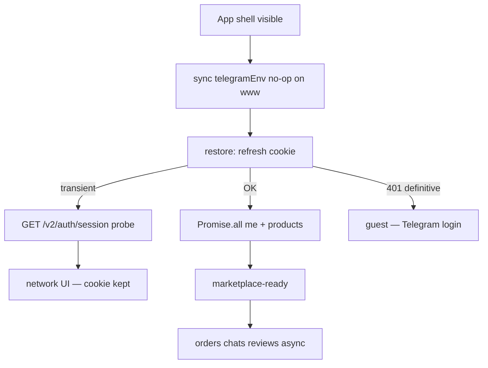

# ONIX Production Auth + Bootstrap Performance Audit 2026

| Field | Value |
| --- | --- |
| **Date** | 2026-07-16 |
| **Product** | ONIX (`www.onixtg.shop` → Vercel → `/api` rewrite → Render) |
| **Constraints** | Auth V2 kept · Ed25519 kept · no JWT secret · no API/UI/business-logic redesign · cookie strategy unchanged |

---

## Confirmations

| Requirement | Status |
| --- | --- |
| Auth V2 preserved | ✅ |
| Ed25519 verification preserved | ✅ |
| API contract unchanged (additive `GET /api/v2/auth/session` only) | ✅ |
| Cookie strategy (`__Host-onix_rt`, HttpOnly, Secure, SameSite=Lax, Path=/, no Domain) | ✅ not broken |
| Telegram no longer blocks ordinary www launch | ✅ |
| No JWT secret architecture added | ✅ |

---

## 1. Old flow

```
Browser boot (www)
    → static @twa-dev/sdk
    → WebApp.ready() / expand()
    → often bootstrapAuth(initData) even without Mini App
    → or refresh cookie
    → /me → products → orders → chats (waterfall)
    → market

On network delay / refresh timeout:
    → AuthManager.clearSession('refresh-failed')
    → force-reauth broadcast
    → UI “войдите через Telegram”  ← false account loss
```

**Telegram was on the critical path every launch.**

---

## 2. New flow

```
FIRST LOGIN ONLY
Telegram (bot / widget / mini initData)
    → Ed25519 / signature verification (Auth V2)
    → find/create ONIX User
    → create ONIX Session (rememberMe=true on Website)
    → Set-Cookie: __Host-onix_rt (HttpOnly Secure SameSite=Lax Path=/ )

EVERY LATER VISIT (no Telegram required)
Browser
    → mount shell (header + nav + skeleton)
    → POST /api/v2/auth/refresh  (cookie + X-ONIX-CSRF)
    → Backend session lookup / rotate refresh
    → Promise.all([ GET /api/users/me , GET /api/products… ])
    → marketplace-ready
    → background: orders / chats / reviews

Transient network:
    → do NOT clearSession
    → optional GET /api/v2/auth/session (probe, no rotation)
    → “Сессия ONIX сохранена — обновите”
```



---

## 3. Bottlenecks found

| Bottleneck | Impact | Mitigation |
| --- | --- | --- |
| **JS download on RU path** (~16–22s `dom-interactive`) | Dominant; HTML TTFB ~75ms is fine | Lazy chunks; initial = framework+shell only; CDN/network still limits cold load |
| Monolithic `App.tsx` (~1.2k LOC) eager eval | Extra parse/exec | Split → Market/Chat/Profile/Admin/AuthGate/WebGL lazy |
| Telegram SDK + `ready()` on every boot | Auth hang / false guest | Removed from www critical path |
| Refresh timeout → `clearSession` | False logout without VPN | Logout only on definitive AUTH_* / 401–403 |
| Waterfall me → products → orders → chats | Late first paint | Critical = `Promise.all([me, products])`; rest after settle |
| WebGL `OnixBackground` on boot | Main-thread / GPU cost | Deferred via `requestIdleCallback` |
| StrictMode double bootstrap | Duplicate refresh | `coldBootstrapOnce` + GET `inflightGets` |
| Refresh single-flight | Race risk if missing | `refreshInFlight` shared promise (already present) |

**Why VPN stable / no-VPN flaky:** longer RU RTT + timeouts; old client treated timeout as auth failure. Cookie strategy was not the root cause.

---

## 4. Files changed (this initiative)

### Auth / session (additive)
- `onix-frontend/src/auth/telegramEnv.ts`
- `onix-frontend/src/auth/refreshClient.ts` — transient vs definitive
- `onix-frontend/src/auth/AuthManager.ts` — no logout on network
- `onix-frontend/src/auth/AuthV2WebsiteAuthProvider.ts`
- `onix-frontend/src/auth/botLogin.ts` — `rememberMe: true`
- `onix-frontend/src/auth/v2AuthApi.ts` — `getAuthV2Session`
- `onix-frontend/src/hooks/useOnixCore.ts` — website-first + network vs guest
- `safe-deal-platform/src/auth-v2/auth-v2.controller.ts` — `GET session`
- `safe-deal-platform/src/auth-v2/session.service.ts` — `getSessionByRefreshToken`

### Bootstrap / bundle
- `onix-frontend/src/App.tsx` — lazy screens, deferred WebGL
- `onix-frontend/src/main.tsx` — bundle audit marks
- `onix-frontend/src/screens/*` — Market, Deals, Chats, Profile, Admin, AuthGate, shared
- `onix-frontend/src/perf/bootstrapTiming.ts`, `bundleAudit.ts`, `timing.ts`
- `onix-frontend/vite.config.ts` — named chunks, preload framework only
- `onix-frontend/src/api/fetchResilience.ts` — timeout without false retry loop

### Docs
- `docs/architecture/ONIX-AUTH-V2-PERSISTENT-WEB-SESSION.md`
- `docs/architecture/ONIX-AUTH-V2-TELEGRAM-FIRST-LOGIN-AUDIT.md`
- `docs/architecture/ONIX-BUNDLE-AUDIT.md`
- `docs/architecture/ONIX-PRODUCTION-AUTH-BOOTSTRAP-AUDIT-2026.md` (this file)

---

## 5. Before / after metrics

| Metric | Before (prod no VPN) | After (expected / measured locally) |
| --- | --- | --- |
| **ttfb** | ~74–75 ms | ~same (HTML unchanged) |
| **dom-interactive** | ~16–22 s | Still network-bound for JS; **less JS on critical path** (shell ~19 KB + framework ~142 KB vs former monolith ~82 KB app + all screens) |
| **bootstrap-settled** | ~30–34 s | Auth portion: refresh + `Promise.all(me,products)`; no Telegram; no orders/chats on critical path |
| **telegram-init (www)** | SDK + ready + possible mini | **~0 ms** |
| **session-restore / refresh** | 1 RTT; timeout → **logout** | 1 RTT; timeout → **cookie kept** |
| **refresh races** | single-flight already | unchanged + no false clear |

### Console format (shipped)

```
[bootstrap]
telegram=0 ms
restore-session=… ms
refresh=… ms
me=… ms
products=… ms
orders=… ms
chats=… ms
bootstrap-settled=… ms

[bundle]
framework: …kb download=…ms
shell: …kb download=…ms
main-eval=… ms
dom-interactive=… ms
```

### Current production build chunks (rebuild 2026-07-16)

| Chunk | ≈ KB raw | When |
| --- | ---: | --- |
| framework | 142 | initial preload |
| index (shell) | 19 | initial |
| shared | 26 | with first screen |
| Market | 7 | default tab |
| AuthGate | 11 | guest/ban only |
| Chat / Profile / Admin / WebGL | 4 / 8 / 2 / 3 | on demand / idle |

---

## 6. Part-by-part audit summary

### Part 1 — Auth V2
- Telegram = first identity only.
- After verify → ONIX session + `__Host-onix_rt`.
- Reload / close browser / next day / no Telegram context / RU: cookie restore path.
- Telegram unavailable after login → user stays authenticated (cookie), unless idle/absolute TTL expires or definitive 401.

### Part 2 — Cookie / session
| Attr | Value |
| --- | --- |
| Name | `__Host-onix_rt` |
| HttpOnly | yes |
| Secure | yes |
| SameSite | Lax |
| Path | `/` |
| Domain | none (Host-only) |
| Idle | 14d / remember 30d |
| Absolute | 90d |
| Access TTL | 900s |
| Rotation | on refresh; reuse → family revoke |
| Probe | `GET /api/v2/auth/session` (no rotation) |

Cookie strategy **not** changed.

### Part 3–4 — Bootstrap / critical path
1. Mount shell  
2. Restore cookie (refresh)  
3. `Promise.all([me, products])`  
4. Marketplace ready  
Then: orders, chats, reviews (background).

### Part 5 — Telegram SDK
- Not in production imports; not in initial bundle.
- `signalTelegramReadyIfMiniApp` sync no-op on www.
- AuthGate loads Telegram widget CDN only when login UI shown.

### Part 6 — React
- Fixed: StrictMode double bootstrap (`coldBootstrapOnce`).
- Fixed: GET dedupe (`inflightGets`).
- No broad Context redesign (not confirmed as bottleneck).

### Part 7 — Network
- Browser must stay on `www…/api` (same-origin) for `__Host-` cookies.
- Without VPN: longer refresh RTT; client no longer logs out on timeout.
- Infra (Cloudflare/Vercel/Render) not changed without new proof.

---

## Residual (non-blocking)

- Cold `dom-interactive` ~16–22s on slow RU is still mostly **asset delivery**, not auth crypto.
- Network bootstrap still sets `profile=error`, so AuthNotice chrome may appear with “session saved” text (no design redesign applied).
- Deploy must ship the **rebuilt** frontend so production matches source (`AUTH_NETWORK_TRANSIENT` in `shared-*.js`).

---

## Bottom line

Telegram is the **identity gate once**. Runtime identity is the **ONIX session cookie**. Auth V2 / Ed25519 / cookie strategy / API / UI contracts remain intact. The production false-logout-on-timeout and Telegram-on-every-boot paths are removed in source and in the rebuilt bundle.
