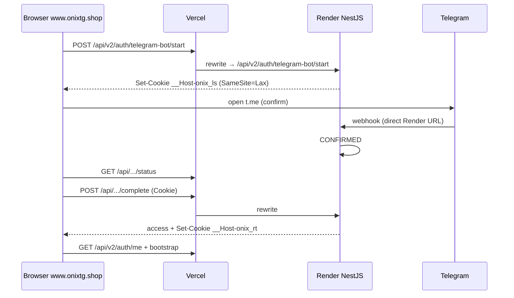

# ONIX Infrastructure — Single-Origin Production Migration

> **CURRENT (2026-09):** still same-origin on `https://www.onixtg.shop`, but the
> public host is **Amvera Moscow**, not Vercel rewrite → Render. Webhook is
> `https://www.onixtg.shop/api/telegram/webhook`. See
> [ONIX-AMVERA-PRODUCTION.md](./ONIX-AMVERA-PRODUCTION.md).
> Tables below are the **2026-07** migration report and are historically useful
> for *why* the browser must not call Render; do not copy the webhook/Vercel
> rows into new ops.

| Field | Value |
| --- | --- |
| **Date** | 2026-07-15 (historical) |
| **Public origin** | `https://www.onixtg.shop` |
| **Then: internal API** | `https://onix-api-47tj.onrender.com` (now **staging only**) |
| **Then: webhook** | Render URL — **superseded**; now www Amvera |

---

## Audit (before)

| Finding | Status |
| --- | --- |
| `onix-frontend/vercel.json` rewrite `/api/:path*` → Render | **Already present** |
| Browser absolute `VITE_API_URL=https://onix-api-47tj.onrender.com` | **Root cause** of cross-origin cookies / CORS / 403 |
| Code paths already support empty base + `credentials: include` | Ready |
| Telegram webhook on Render | Correct — leave as-is |

---

## 1. Sequence (browser)



---

## 2. Architecture

```
Browser ──only──► https://www.onixtg.shop
                      │
                      ├─ SPA assets
                      └─ /api/*  ──rewrite──►  onix-api-47tj.onrender.com/api/*
                                                    │
Telegram ──webhook──► onix-api-47tj.onrender.com/api/telegram/webhook
                                                    │
                                                    └─► Neon
```

---

## 3. Files changed

| File | Change |
| --- | --- |
| `onix-frontend/vercel.json` | Confirmed rewrite (unchanged destination) |
| `onix-frontend/src/auth/apiConfig.ts` | Strip absolute API bases → always relative `/api` |
| `onix-frontend/vite.config.ts` | `VITE_API_PROXY_TARGET` for local proxy |
| `onix-frontend/.env.example` | Empty `VITE_API_URL` |
| `.env.example` | Empty `VITE_API_URL`; CORS includes onixtg.shop |
| `login-session-cookie.ts` | SameSite=**Lax** (single-origin) |
| Frontend/backend tests | Expect relative `/api` |
| This doc | Migration report |

**Not changed:** Auth V2, SessionService, TokenService, AuthManager, LoginChallenge state machine, webhook URL.

---

## 4–6. Why cookies / CORS work

- Browser host for API is `www.onixtg.shop` → same-site as SPA.
- `__Host-onix_ls` / `__Host-onix_rt` with `SameSite=Lax; Secure; Path=/` apply to that host.
- Browser↔Render CORS no longer applies to Website XHR (rewrite is server-side).
- CORS on Nest still useful for localhost Vite / residual clients — origins not auto-deleted.

---

## 7. Legacy (not deleted)

| Item | Status |
| --- | --- |
| `POST .../telegram-bot/continue` | Deprecated, throws |
| `continueBotLogin` FE stub | Throws |
| `exchangeCodeHash` Prisma fields | Unused on confirm |
| Widget login + `location.reload` | Rollback path |
| Absolute URL strings in **tests/docs** only | OK |

---

## 8. Production readiness / ops

1. **Vercel env:** unset or empty `VITE_API_URL` (rebuild SPA).
2. Confirm rewrite in Project → Deployments (destination Render).
3. Render `CORS_ORIGINS` may include `https://www.onixtg.shop` (harmless).
4. Webhook stays on Render URL.
5. Redeploy frontend after env change.

---

## 9. Verification checklist

- Network: only `www.onixtg.shop/api/...` — no `onrender.com` from browser.
- Bot login: start → cookie → confirm → complete → `/me` → bootstrap.
- Persist: refresh cookie → restore session.
